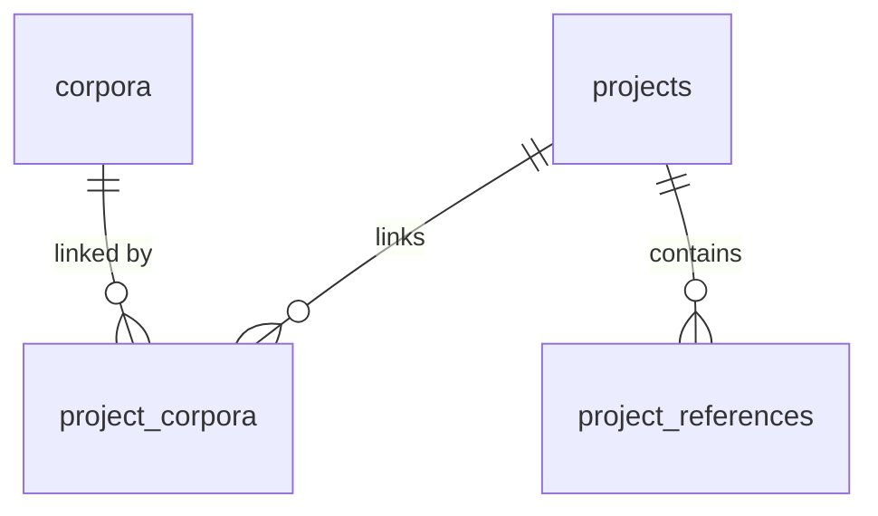

# Data Model: Project Workspace

**Feature**: 001-project-workspace | **Date**: 2026-07-19
**Storage**: Supabase Postgres (`public` schema). Corpus files live in Hugging Face bucket storage and are only *pointed to* from here.

## Entity Overview

## Tables

### `projects`

The workspace container (spec: Project entity).

| Column | Type | Constraints | Notes |
| --- | --- | --- | --- |
| `id` | `uuid` | PK, default `gen_random_uuid()` | |
| `name` | `text` | NOT NULL, `length(trim(name)) > 0` | Required by FR-001; duplicates allowed (edge case) |
| `description` | `text` | NULL | Optional |
| `owner_id` | `uuid` | NULL, indexed | Empty until `corpora-auth` ships (FR-011) |
| `created_at` | `timestamptz` | NOT NULL default `now()` | FR-010 |
| `updated_at` | `timestamptz` | NOT NULL default `now()` | Touched by trigger on update, and by data layer when child rows change (FR-002 sort) |

**Validation**: name required, trimmed non-empty; enforced in the form AND by the check constraint.
**Lifecycle**: create → edit (rename/description) → delete (cascades to `project_corpora`, `project_references`). Delete requires UI confirmation (FR-005); no soft-delete in v1.

### `corpora`

Corpus **metadata** records (owned by the Library feature; read-only for this feature, created here only because the table must exist first). Mirrors the identification core of `ICorpusManifest` from the Corpora schema vault, plus the bucket pointer.

| Column | Type | Constraints | Notes |
| --- | --- | --- | --- |
| `id` | `uuid` | PK, default `gen_random_uuid()` | |
| `uid` | `text` | NOT NULL, UNIQUE | Manifest `uid` of the `.corpus` archive |
| `name` | `text` | NOT NULL | Manifest `name` |
| `description` | `text` | NULL | |
| `version` | `text` | NOT NULL default `'0.0.0'` | Manifest semver |
| `language` | `text` | NULL | Display name (e.g., "Aramaic") |
| `language_code` | `text` | NULL | ISO 639 code |
| `type` | `text` | NULL | `CorpusEnum` value (`bible`, `lexicon`, …) — kept as text, enum owned by Library later |
| `category` | `text` | NULL | `CategoryEnum` value |
| `hf_path` | `text` | NULL | Hugging Face bucket object path/URL for the corpus file |
| `available` | `boolean` | NOT NULL default `true` | Library flips false when the bucket object is gone → FR-008 stale rendering |
| `owner_id` | `uuid` | NULL, indexed | Future auth |
| `created_at` / `updated_at` | `timestamptz` | NOT NULL default `now()` | |

### `project_corpora`

The Corpus Link entity — many-to-many workspace association (deliberately independent of the manifest's compile-time `projectId`; see research R4).

| Column | Type | Constraints | Notes |
| --- | --- | --- | --- |
| `project_id` | `uuid` | NOT NULL, FK → `projects(id)` ON DELETE CASCADE | FR-005: project delete unlinks |
| `corpus_id` | `uuid` | NOT NULL, FK → `corpora(id)` ON DELETE CASCADE | Corpus removal clears links |
| `linked_at` | `timestamptz` | NOT NULL default `now()` | |
| — | — | PK (`project_id`, `corpus_id`) | FR-007: no duplicate links |

### `project_references`

The Reference entity (spec: bibliographic entry, one project each).

| Column | Type | Constraints | Notes |
| --- | --- | --- | --- |
| `id` | `uuid` | PK, default `gen_random_uuid()` | |
| `project_id` | `uuid` | NOT NULL, FK → `projects(id)` ON DELETE CASCADE | FR-005 |
| `title` | `text` | NOT NULL, `length(trim(title)) > 0` | FR-009 required field |
| `authors` | `text` | NULL | Free-form ("Last, F.; Last, F.") in v1 |
| `year` | `smallint` | NULL | |
| `publication` | `text` | NULL | Journal/publisher/container |
| `url` | `text` | NULL | Source link |
| `created_at` / `updated_at` | `timestamptz` | NOT NULL default `now()` | |

## Indexes

- `projects (updated_at desc)` — list ordering (FR-002, SC-004)
- `project_corpora (corpus_id)` — reverse lookups (PK already covers `project_id` prefix)
- `project_references (project_id)` — workspace load
- `projects (owner_id)`, `corpora (owner_id)` — future auth filtering (cheap now, needed later)

## Row-Level Security (v1 posture)

RLS **enabled** on all four tables with permissive policies granting the `anon` role full select/insert/update/delete — the clarified "one shared pool" temporary state. The auth cutover replaces these policies with `owner_id = auth.uid()` rules without schema changes (research R2/R3).

## State & Concurrency Notes

- **Stale link (FR-008)**: join row present + `corpora.available = false` → render "unavailable", offer unlink. (Row deletion cascades, so a missing corpus row cannot leave an orphan link.)
- **Last-write-wins (clarification Q3)**: no version/etag columns; `updated_at` is informational only.
- **Deleted elsewhere**: loaders returning zero rows for a known id render the "no longer exists" state; actions on missing ids surface a save error (FR-013).
