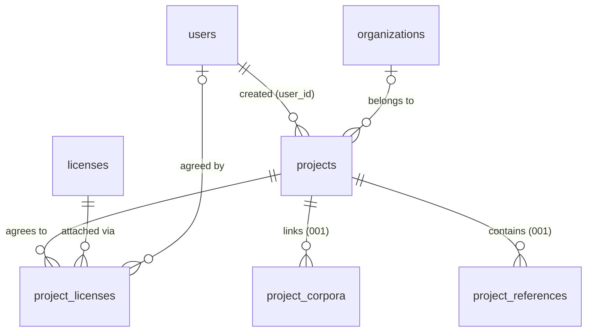

# Data Model: Project Detail

**Feature**: 002-project-detail | **Date**: 2026-07-19
**Storage**: Supabase Postgres (`public` schema). Additive migration on the 001 schema — no 001 column is renamed, retyped, or dropped.

## Entity Overview



## Vocabularies (text + CHECK, research R1)

Source of truth: `corpora-tauri/packages` domain enums. Stored as the exact persisted strings.

| Vocabulary | Values | Used by |
| --- | --- | --- |
| `status` | `draft`, `started`, `progress`, `completed`, `failed` | `projects.status` (default `draft`) |
| `book type` | `bible`, `commentary`, `lexicon`, `biography`, `review`, `manuscript`, `tanakh`, `quran`, `apocrypha`, `regular` | `projects.type` |
| `language` | `hebrew`, `greek`, `syriac`, `arabic`, `aramaic`, `protoCuneiform`, `akkadian`, `ugaritic`, `pali`, `latin`, `dutch`, `french`, `italian`, `english` | `projects.language` |
| `category` | `biblical`, `religious`, `literary`, `historical`, `paratext` | `projects.category` |
| `license status` | `active`, `retired`, `superseded` | `licenses.status` |

## Tables

### `user_directory` (NEW — seeded directory, read-only to the app)

Mirrors `user.rs`. Populated by the migration's dummy seed (fixed UUIDs); replaced/claimed by `corpora-auth` later via `auth_id`. The app only reads it (FR-018).

> **Implementation note (T001)**: originally planned as `users`, but the remote database already carries corpora-auth's `public.users` profile table (FK to `auth.users` + signup trigger), which cannot hold dummy rows. The seeded directory therefore lives in `public.user_directory`; at the auth cutover, `projects.user_id` re-points to `public.users` using the `auth_id` mapping and the directory is dropped.

| Column | Type | Constraints | Notes |
| --- | --- | --- | --- |
| `id` | `uuid` | PK | Fixed UUIDs in seed for idempotency/backfill |
| `name` | `text` | NULL | Display name |
| `username` | `text` | NOT NULL, UNIQUE, non-empty trimmed | Shown as creator fallback |
| `email` | `text` | NOT NULL, UNIQUE | |
| `phone` / `website` / `system_path` / `operating_system` | `text` | NULL | Domain-model parity |
| `address_street` / `address_suite` / `address_city` / `address_zipcode` / `address_country` | `text` | NULL | Domain-model parity |
| `organization_id` | `uuid` | NULL, FK → `organizations(id)` ON DELETE SET NULL | Domain-model parity |
| `auth_id` | `uuid` | NULL, UNIQUE | Reserved: Supabase auth principal claim at cutover (research R4) |
| `created_at` | `timestamptz` | NOT NULL default `now()` | |

**Seed**: ~6 dummy users; `00000000-0000-4000-8000-000000000001` is the designated default user used for backfill (FR-017).

### `organizations` (NEW)

Mirrors `organization.rs`. Created inline by users (pick-or-create, research R5).

| Column | Type | Constraints | Notes |
| --- | --- | --- | --- |
| `id` | `uuid` | PK, default `gen_random_uuid()` | |
| `name` | `text` | NOT NULL, non-empty trimmed | FR-014 required |
| `website` | `text` | NULL | |
| `created_at` | `timestamptz` | NOT NULL default `now()` | |

### `licenses` (NEW — seeded catalog, read-only to the app)

Catalog half of `license.rs` (research R3). Ships **empty**; the user uploads a SQL seed later — the UI must handle zero rows (FR-011).

| Column | Type | Constraints | Notes |
| --- | --- | --- | --- |
| `id` | `text` | PK | Natural key (e.g. `CC-BY-4.0`) for human-writable seeds |
| `title` | `text` | NOT NULL | |
| `url` | `text` | NULL | Link to license text |
| `domain_content` | `boolean` | NOT NULL default `false` | |
| `domain_data` | `boolean` | NOT NULL default `false` | |
| `domain_software` | `boolean` | NOT NULL default `false` | |
| `family` | `text` | NULL | |
| `maintainer` | `text` | NULL | |
| `is_generic` | `boolean` | NULL | |
| `license_text` | `text` | NULL | Full text |
| `status` | `text` | NOT NULL, CHECK ∈ license-status vocabulary | Retired/superseded shown but discouraged |

### `project_licenses` (NEW — attachment with agreement)

Per-attachment half of `license.rs` (research R3).

| Column | Type | Constraints | Notes |
| --- | --- | --- | --- |
| `project_id` | `uuid` | NOT NULL, FK → `projects(id)` ON DELETE CASCADE | Project delete removes attachments |
| `license_id` | `text` | NOT NULL, FK → `licenses(id)` ON DELETE RESTRICT | Catalog rows with attachments can't vanish |
| `agreed_at` | `timestamptz` | NOT NULL default `now()` | FR-012 |
| `agreed_by_user_id` | `uuid` | NOT NULL, FK → `users(id)` ON DELETE RESTRICT | FR-012 (creator can't be anonymous ⇒ agreeing user always known) |
| — | — | PK (`project_id`, `license_id`) | FR-010: no duplicate attachment |

### `projects` (EXTENDED — additive columns only)

001 columns unchanged (`id`, `name`, `description`, `owner_id`, `created_at`, `updated_at`). `owner_id` stays reserved for the auth principal (research R4).

| New Column | Type | Constraints | Notes |
| --- | --- | --- | --- |
| `status` | `text` | NOT NULL default `'draft'`, CHECK ∈ status vocabulary | FR-002/FR-003; existing rows take the default (FR-017) |
| `type` | `text` | NULL, CHECK ∈ book-type vocabulary | FR-005 optional |
| `language` | `text` | NULL, CHECK ∈ language vocabulary | Conditional, see constraint below |
| `category` | `text` | NULL, CHECK ∈ category vocabulary | Conditional, see constraint below |
| `organization_id` | `uuid` | NULL, FK → `organizations(id)` ON DELETE SET NULL | FR-014; org removal detaches (spec edge case) |
| `user_id` | `uuid` | NOT NULL (after backfill), FK → `users(id)` ON DELETE RESTRICT | FR-015 creator; backfilled to default user (FR-017) |

**Conditional classification constraint** (`projects_classification_check`, research R2 — enforces FR-006–FR-009 / SC-003):

```sql
check (
  (type in ('bible','tanakh','quran','apocrypha') and language is not null and category is null)
  or (type in ('biography','commentary','review') and category is not null and language is null)
  or ((type is null or type in ('lexicon','manuscript','regular')) and language is null and category is null)
)
```

**Migration order**: create `organizations` → `users` (seed dummies) → `licenses` → `project_licenses` → alter `projects` (add columns nullable → backfill `user_id` to default user → `SET NOT NULL` → add CHECKs) → enable RLS + permissive policies on all new tables → indexes.

## Indexes

- `projects (organization_id)`, `projects (user_id)` — FK lookups
- `project_licenses (license_id)` — reverse lookup (PK covers `project_id` prefix)
- `users (username)` unique, `users (email)` unique, `users (auth_id)` unique — constraints double as indexes

## Integrity & Lifecycle Summary

- **Status**: free movement among the five states from the UI (no transition matrix in v1); default `draft`.
- **Classification**: single-statement update of (`type`, `language`, `category`); DB constraint makes invalid combinations unrepresentable.
- **Licenses**: attach (insert with agreement), detach (delete); catalog is read-only; duplicate attach = PK violation surfaced as "already attached".
- **Organization**: assign/replace (update FK), remove (null FK); org deletion detaches via `SET NULL`.
- **Creator**: set once at creation, immutable in the UI; `RESTRICT` prevents deleting a user who owns projects.
- **updated_at**: every metadata mutation touches `projects.updated_at` (FR-016), same mechanism as 001.
- **RLS**: enabled on `users`, `organizations`, `licenses`, `project_licenses` with permissive anon policies (write policies only where the app writes: organizations insert/update, project_licenses insert/delete; users and licenses are select-only), matching the pre-auth posture of 001 (Constitution IV).
